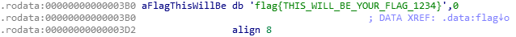
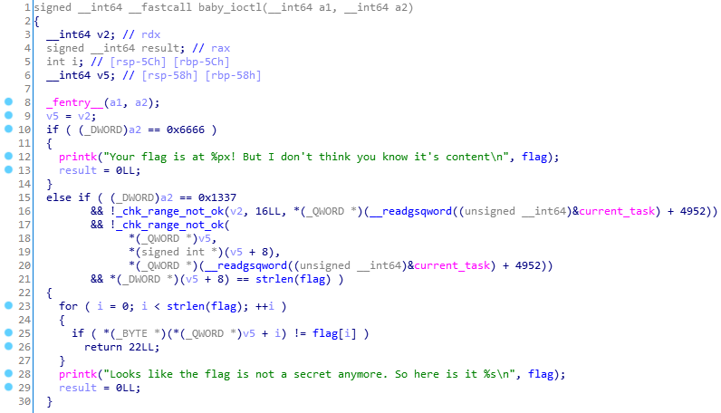

* TOC
{:toc}

### Environment
* ubuntu 20.04
* qemu 7.0.0
* kernel version 4.15.0-22-generic SMP mod_unload
  ```shell
  sjy@ubuntu:~/ctf/2018-0ctf-final-baby$ strings baby.ko | grep vermagic=
  vermagic=4.15.0-22-generic SMP mod_unload
  ```
* [qemu stratup script](https://github.com/ret2p4nda/kernel-pwn/blob/master/0ctf-final-baby/start.sh)
   ```
   qemu-system-x86_64 \
   -m 256M -smp 2,cores=2,threads=1  \
   -kernel ./vmlinuz-4.15.0-22-generic \
   -initrd ./core.cpio \
   -append "root=/dev/ram rw console=ttyS0 oops=panic panic=1 quiet" \
   -cpu qemu64 \
   -netdev user,id=t0, -device e1000,netdev=t0,id=nic0 \
   -nographic  -enable-kvm
  ```
  * `-kernel bzImage`  
    Use bzImage as kernel image. The kernel can be either a Linux kernel or in multiboot format.
  * `-initrd file`  
    Use file as initial ram disk.
### Problem Analysis
* Open baby.ko(ELF) with IDA64.
* Flag  
  The flag is hard-coded by the driver in its data segment and the length of the flag is 33.
    
  
* `baby_iotctl()`  
    
  There are two command numbers.  
  * 0x6666  
    Print the flag's address in the kernel address space.
  * 0x1337  
    Perform four checks on our input and print the flag if the input passes all the checks. Four checks respectively lie in line 16, line 17, line 21 and line 25.  
    [`__readgsqword()`](https://learn.microsoft.com/zh-cn/cpp/intrinsics/readgsbyte-readgsdword-readgsqword-readgsword) reads memory from a location specified by an offset relative to the beginning of the GS segment.  
* `_chk_range_not_ok()`  
    
  While [`__CFADD__()`](https://gist.github.com/Dliv3/d011325312292182a9674797761d2b41) represens the carry flag of addition(x+y), `_chk_range_not_ok()` returns 1 only if a1+a2>a3 or a1+a2 generates an arithmetic carry.  
  Through dynamic debugging, it is found that the third parameter is always 
  `0x00007ffffffff000`, [which is the boundary of user space in the 64-bit system.](https://paper.seebug.org/papers/Archive/refs/heap/glibc%E5%86%85%E5%AD%98%E7%AE%A1%E7%90%86ptmalloc%E6%BA%90%E4%BB%A3%E7%A0%81%E5%88%86%E6%9E%90.pdf)
* All the checks  
  1. `[v2,v2+16]` is in user space.
  2. `[v5,v5+(signed int*)(v5+8)]` is in user space. (`v5=v2`)
  3. `(dword*)(v5+8)` equals to `strlen(flag)`。
  4. `(byte*)((qword*)(v5)+i)` equals to `flag[i]` while `0<=i<strlen(flag)`. 
   
  Therefore, it is supposed that `v2` points to a struct(defined as `Data`), with two 8-bytes members.
  ```c
  typedef struct {  
   char* addr;  
   size_t len;
   } Data;
  ```
  In conclusion, `Data v2` is a user space variable, `(char*)(v2->addr)` equals to `(char*)flag` and `(v2->len)` equals to `strlen(flag)`. 
  
### Double Fetch vulnerability
* The double fetch vulnerability is a specific type of time-of-check to time-of-use (TOCTOU) bug, generally occurring in shared memory interfaces. For example, when a kernel function reads a user data twice, the first read is to perform some security checks on the data or establish a connection and the second is for the real use. Between this two kernel read operations, a malicious thread in user mode can tamper with that data, thus causing inconsistencies in the data used by the kernel.
* For this problem, if we do not know the content of the real flag, by no means can we create the variable `Data v2` to pass all the checks. However, while the kernel function reads the user space address twice to check and use respectively, we could create a malicious thread that tampers with `v2->addr` to the real kernel address of the flag after `v2` passes the first three checks. Now, `v2` could pass the fourth check and `iotcl()` will print the content of flag. Since our attack requires multiprocessing, the qemu startup script contains something like `-smp 2`.

### Exploit
* Source code: https://ctf-wiki.org/pwn/linux/kernel-mode/exploitation/double-fetch/#2018-0ctf-finals-baby-kernel  
  I change `TRYTIME` from `0x1000` to `0x10000` to increase the success rate of an exploit.
  


### Reference
* https://ypl.coffee/0ctf-2018-finals-baby-kernel/
* http://p4nda.top/2018/07/20/0ctf-baby/
* https://ctf-wiki.org/pwn/linux/kernel-mode/exploitation/double-fetch/#2018-0ctf-finals-baby-kernel
* https://www.cnblogs.com/T1e9u/p/13837662.html
* https://x3h1n.github.io/2019/08/27/20180ctf-final-baby/